# Report on Lab2
## Завдання на лабораторну роботу.
### 1) Вивчити команду tree. Освоїти техніку застосування шаблону, наприклад, вивести всі файли, які містять символ с, або файли, які містять певну послідовність символів. Вивести підкаталоги кореневого каталогу до другого рівня вкладеності включно.

Про команду tree:

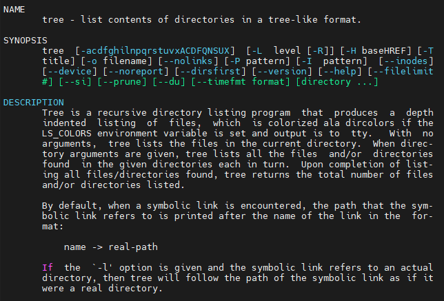

Застосування tree:

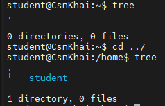

Файли з символом 'c':

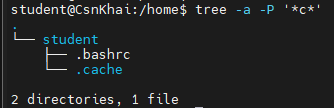

Файли з послідовністю:

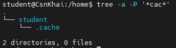

---

### 2) За допомогою якої команди можна визначити тип файлу (наприклад, текстовий чи бінарний)? Навести приклад.

За допомогою команди file. Приклад застосування:

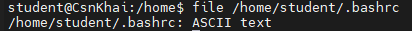

---

### 3) Опанувати навички навігації по файловій системі за допомогою відносних та абсолютних шляхів. Як можна повернутися до домашнього каталогу з будь-якого місця у файловій системі?

Для показу поточного каталогу використовується команда pwd. За допомогою команди cd можна переміщуватись по файлах/папках та повернутися до домашнього каталогу.

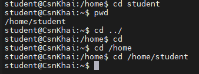

---

### 4) Ознайомитись із різними ключами команди ls. Навести приклади роздруківки каталогів за допомогою різних ключів. Пояснити виведену на термінал інформацію за допомогою ключів -l та -a.

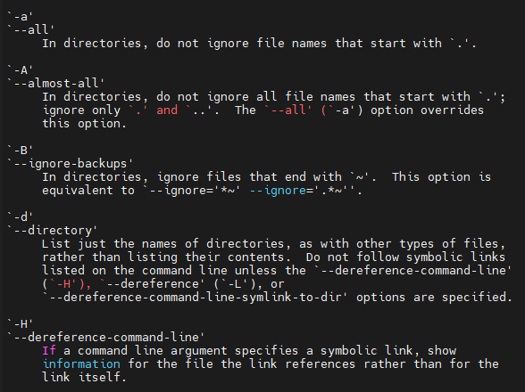

Ключі -l та -a:

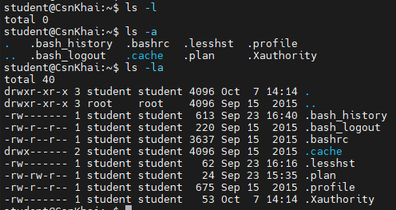

-l виводить докладно інформацію про каталоги. -a показує приховані каталоги.

Перша колонка - тип та права доступу.\
Друга колонка - кількість жорстких посилань.\
Третя колонка - власник.\
Четверта колонка - група.\
П'ята колонка - розмір.\
Шоста колонка - дата/час зміни.\
Сьома колонка - сам файл.

---

### 5) Виконати таку послідовність операцій:
### - створити в домашньому каталозі підкаталог;

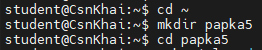

### - у цьому підкаталозі створити файл, що містить інформацію про каталоги, що знаходяться в кореневому каталозі (використовуючи операції перенаправлення введення-виведення);

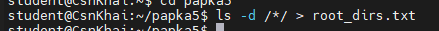

### - переглянути створений файл;

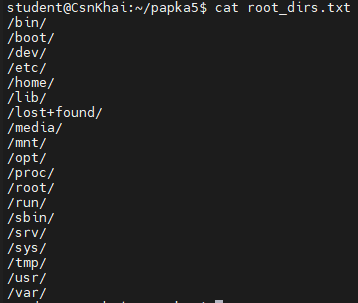

### - скопіювати створений файл у домашній каталог, використовуючи відносну та абсолютну адресацію;

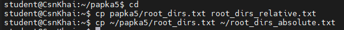

### - видалити створений раніше підкаталог із файлом із запитом на видалення;

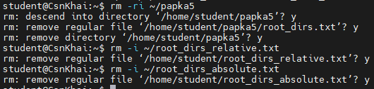

### - видалити файл, скопійований до домашнього каталогу.

Повний вигляд:

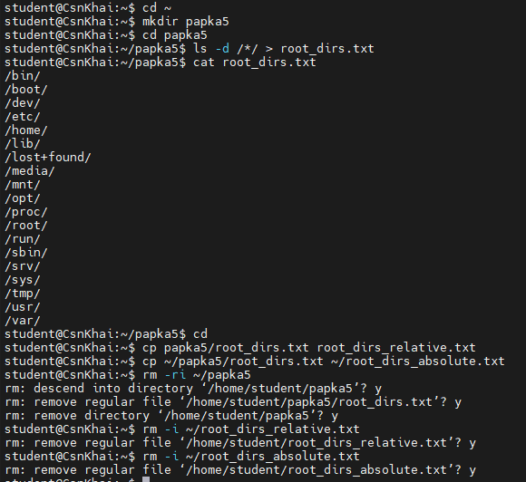

---

### 6) Виконати таку послідовність операцій:
### - створити в домашньому каталозі підкаталог test;

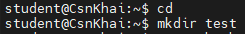

### - скопіювати в цей каталог файл .bash_history, змінивши його ім'я на labwork2;

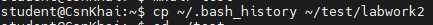

### - створити жорстке та м'яке посилання на файл labwork2 у підкаталозі test;

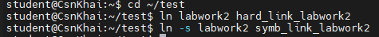

### - як визначити м'яке та жорстке посилання, що означають ці поняття;

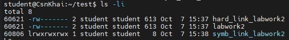

М'яке посилання має на початку символ 'l', тоді як жорстке посилання має на початку символ '-'. Жорстке посилання - прямо вказує на ті ж самі дані, що є у вихідному файлі. М'яке посилання - окремий файл, який зберігає шлях до оригінального файлу/папки.

### - змініть дані, відкривши символічне посилання. Які зміни відбудуться і чому?

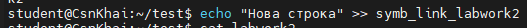

В symb_link_labwork2 та labwork2 додалась "Нова строка":

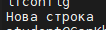

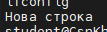

Це трапилось тому що м'яке посилання вказує на labwork2, і через це змінюється вміст цього labwork2.

### - перейменуйте файл жорсткого посилання на файл hard_lnk_labwork2;

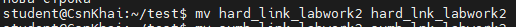

### - перейменуйте файл м'якого посилання на файл symb_lnk_labwork2;

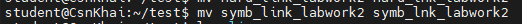

### - потім видаліть файл labwork2. Які відбулися зміни та чому?

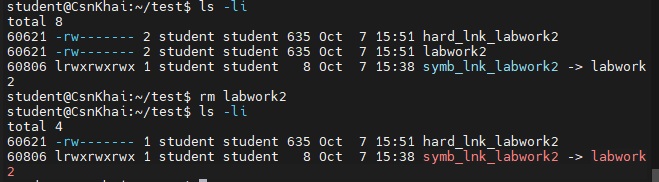

Жорстке посилання продовжить працювати, бо воно вказує на самі дані, а м'яке посилання зламається, бо воно вказує на сам файл labwork2 якого вже не існує. 

---

### 7) Використовуючи утиліту locate знайти всі файли, в яких зустрічається послідовність squid і traceroute.

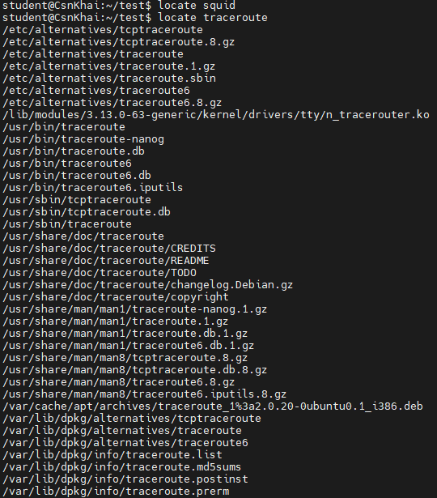

---

### 8) Визначити, які розділи змонтовані у системі, і навіть типи цих розділів.

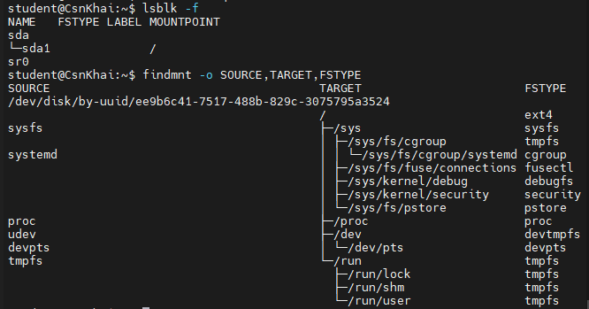

---

### 9) Підрахувати кількість рядків, що містять задану послідовність символів у заданому файлі.

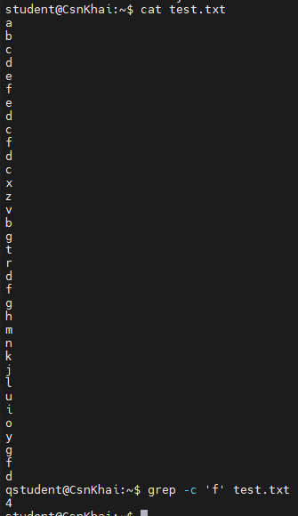

---

### 10) Використовуючи команду find знайти всі файли в каталозі /etc, що містять послідовність символів host.

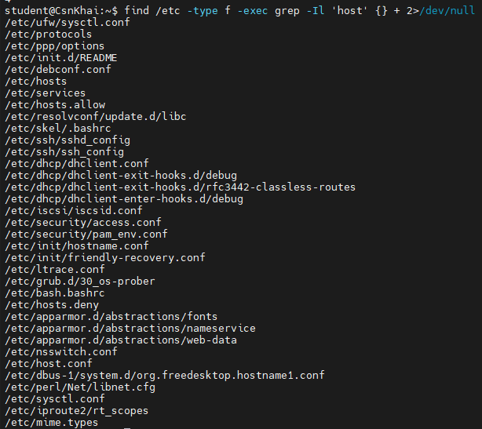

find /etc - шукати в /etc.\
-type f - тільки звичайні файли.\
grep -Il - не обробляти бінарні файли та вивести імена файлів.\
'host' - те, що шукаємо.\
2>/dev/null - прибрати сповіщення про недоступні файли.

---

### 11) Вивести всі об'єкти каталогу /etc, що містять послідовність символів ss. Як можна продублювати аналогічну команду, використовуючи зв'язку з командою grep?

Через find:

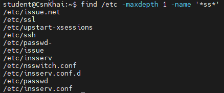

Через grep:

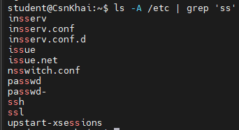

---

### 12) Організувати поекранну роздруківку вмісту каталогу /etc. Підказка: необхідно використовувати операції перенаправлення потоків.

Перенаправлення в файл:

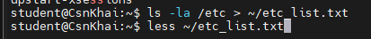

Файл з вмістом:

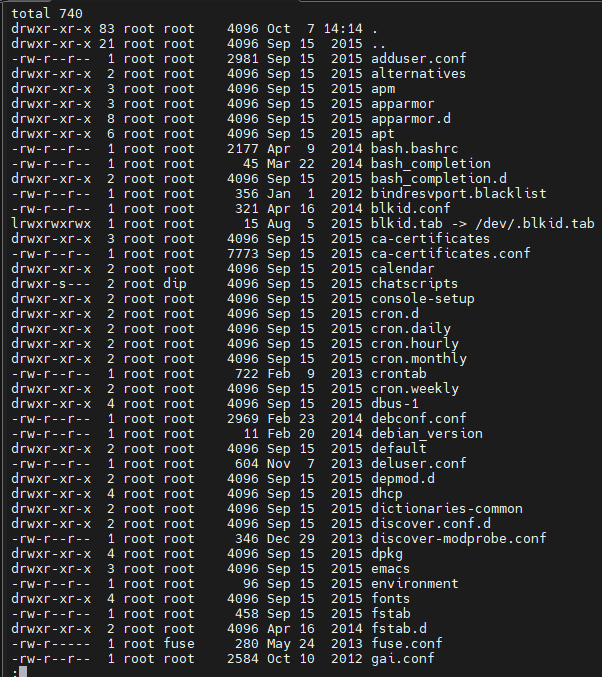

---

### 13) Які бувають типи пристроїв і як визначити тип пристрою? Навести приклади.

Основні пристрої представлені як спеціальні файли каталогу /dev. Основні типи - блокові та символьні. Їх можна визначити за першим символом у виводі ls -l, а також за допомогою команди file.

Наприклад:

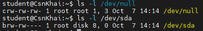

Перший символ 'c' - символьне. Перший символ 'b' - блокове.
---

### 14) Як визначити тип файлу у системі, які типи файлів бувають?

Визначити тип файла можна за допомогою команд file, stat або ls. Типи файлів: звичайний файл(-), каталог(d), символьне посилання(l), символьний пристрій(c), блоковий пристрій(b), FIFO(p), сокет(s).

---

### 15) Вивести перші 5 файлів каталогу, яких нещодавно здійснено доступом у каталозі /etc.

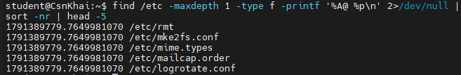
